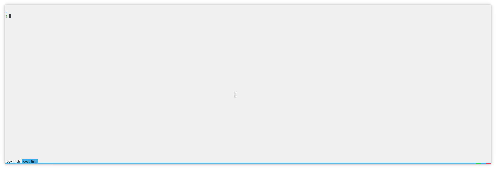

# [Yakuake Breeze Light Minimal Theme](https://store.kde.org/p/1319007)

Yakuake minimal theme matching the breeze light colorscheme. Based on the [Breeze minimal theme](https://store.kde.org/p/1106236).



## Installation

1. Tar the theme

    ```bash
    $ tar -zcf yakuake-breeze-light-minimal.tar.gz yakuake-breeze-light-minimal
    ```

2. Import the theme in yakuake
